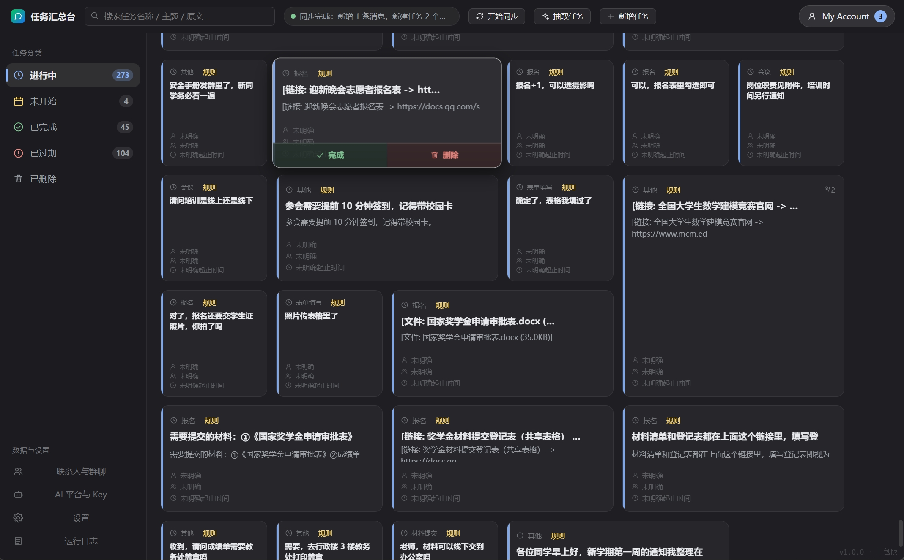
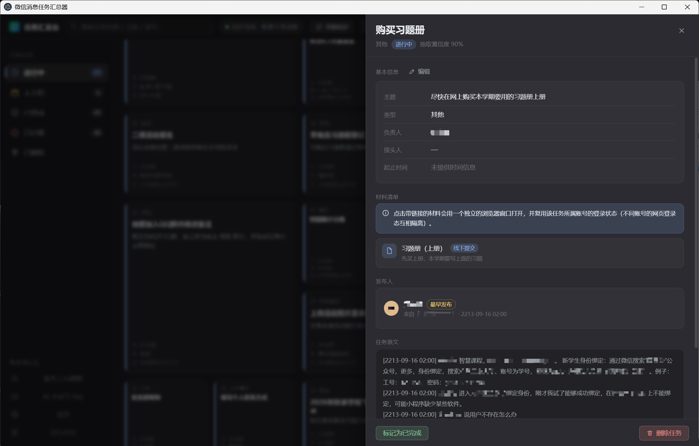

# 微信消息任务汇总器与展示台（WX_msg_grb）

> 一个**纯本地**运行的 Windows 桌面程序：读取你本机的微信 / QQ 聊天记录，用大模型从中**抽取任务**，
> 再以 Windows 10 开始菜单「动态磁贴」的形式分类展示。

[](./LICENSE)


---

## 目录

- [这是什么](#这是什么)
- [功能特性](#功能特性)
- [截图](#截图)
- [依赖说明](#依赖说明)
- [安装步骤](#安装步骤)
- [使用指南](#使用指南)
- [已知限制](#已知限制)
- [隐私声明](#隐私声明)
- [从源码构建](#从源码构建)
- [许可证](#许可证)
- [贡献指南](#贡献指南)

---

## 这是什么

群里天天有人发通知、报名、要材料、发问卷——散落在几十个群和无数条消息里，很容易漏。
本软件把这些聊天记录交给大模型（LLM），自动识别出「需要去做的事」，抽取成结构化任务，
用磁贴墙集中展示，并按**进行中 / 未开始 / 已完成 / 已过期 / 已删除**分类管理。

所有数据**只在本机处理**：聊天记录、账号信息、API Key 全部用 PBKDF2 派生的密钥加密后存储，
数据库文件整体加密，不上传任何第三方（调用 LLM 时只发送你选定的那些聊天片段）。

---

## 功能特性

- **自动抓取任务**：读取微信（经 `wechat_exp`）与 QQ（经 QQFlow 提取的密钥）聊天记录，
  交给 LLM 抽取任务名称、主题、类型、负责人、接头人、起止时间、材料清单。
- **附件内容读取**：聊天里的文件（`.docx` / `.xlsx` / `.pdf` / `.txt` / `.md`）与链接，
  会读取标题与正文一起判断是否含任务信息。
- **手动添加 / 编辑任务**：可新建自定义任务，也可编辑抓取到的任务的名称、主题、负责人、
  接头人、起止时间（现代日历选择器，改动自动保存）；名称/主题留空时可让 AI 生成。
- **多平台 LLM**：支持 DeepSeek、ChatGPT、通义千问、文心一言、Gemini、Claude，
  自动检测 Key 可用性并选用该平台价格最低的模型。
- **任务自动去重**：同一任务被多人在多群发布时自动合并发布人，不会重复出现。
- **磁贴墙展示**：类似 Win10 开始菜单的动态磁贴，可拖拽排列、网格吸附、悬停放大。
- **五类状态管理**：按起止时间自动归类，实时重分类；支持人工确认完成。
- **多选与批量操作**：全选 / 反选 / 批量删除 / 批量恢复，风格参考手机相册多选。
- **「已删除」回收站**：删除只是移入「已删除」分类，可随时恢复（恢复后按时间重新归类）。
- **系统托盘与后台捕获**：常驻托盘，可在后台持续监听平台登录状态。
- **按账号隔离的链接打开**：点击任务里的在线链接，用获取该任务的账号的独立会话打开。

---

## 截图

> 📷 待补充：请在此处放 1–2 张主界面截图（磁贴墙 + 任务详情）。
>
> 建议将图片放到 `docs/images/` 下再引用，例如：
>
> ```markdown
> 
> 
> ```

---

## 依赖说明

本软件**不打包、不分发**任何第三方工具。运行时需要你**自行下载**下面这两个工具：

| 工具 | 用途 | 获取方式 |
|---|---|---|
| **wechat_exp** | 读取本机微信聊天记录（提供本地 HTTP 接口） | <https://github.com/sunhanaix/pc_wechat_exp/releases> |
| **QQFlow** | 提取 QQ 数据库密钥（本软件不注入 QQ 进程） | <https://github.com/yfgug/QQFlow> |

放置方式：把下载到的 `wechat_exp*.exe` / `QQFlow*.exe` 放到**软件目录**或其下的 `tools\` 子目录，
也可以在软件「设置 → 数据来源 / 托盘与后台」里手动指定路径。

> ⚠️ 这两个工具是第三方开源项目，各自遵循其自身许可条款（详见 [许可证](#许可证)）。
> 本项目仅调用它们，不对其安全性、可用性做任何担保。
>
> ℹ️ **QQFlow 官方仓库不提供预编译产物**（无 Release），只有 Rust/Tauri 源码；
> 若你不会自行编译，QQ 这条链路就无法使用——**不影响微信功能**，软件可正常启动使用。

---

## 安装步骤

1. 到本仓库的 [Releases](https://github.com/MoonCat-640/WX_msg_grb/releases) 页面下载
   最新的 `Setup.exe`。
2. 双击运行，按向导完成安装（可选语言、安装路径、当前用户/全体用户、是否加入 PATH）。
   安装过程中会有一个**依赖检查**步骤，提示你是否已准备好 `wechat_exp` 与 `QQFlow`
   （只提示，不会代为安装）。
3. 安装完成后，从桌面或开始菜单的快捷方式启动 **微信消息任务汇总器**。
4. 首次启动会显示「首次配置」向导，依次完成：**添加账号 → 选择联系人与群聊 → 配置 AI Key**。

> 只想先看看界面？在向导里直接关闭，然后到「设置 → 数据来源」点**装载演示数据**，
> 无需任何真实微信环境即可体验完整流程。

---

## 使用指南

| 操作 | 位置 |
|---|---|
| 添加 / 移除账号 | 右上角「My Account」→ 账户管理 |
| 微信：识别本机已登录账号 | 添加账号 → 微信 → 「检测本机已登录账号」 |
| QQ：登记账号 | 添加账号 → QQ → 扫描数据库 + 填密钥（或「从 QQFlow 导入」） |
| 选择要读取的联系人与群聊 | 左侧「联系人与群聊」 |
| 开始 / 停止实时同步（默认 30 秒轮询） | 顶栏「开始同步 / 停止同步」 |
| 手动触发一次任务抽取 | 顶栏「抽取任务」 |
| **手动新建任务** | 顶栏「**新增任务**」→ 自动打开详情面板 |
| **编辑任务**（改完自动保存） | 详情面板右上角「**编辑**」 |
| 完成任务 / 删除任务 | 鼠标移到磁贴上，底部出现按钮，**按住 1.5 秒**生效 |
| 彻底删除 | 「已删除」分类里**长按**磁贴 → 二次确认 |
| 托盘 / 后台捕获开关 | 左侧「设置 → 托盘与后台」 |
| 查看运行日志 | 左侧「运行日志」 |

### 数据与日志位置

| 内容 | 路径 |
|---|---|
| 加密数据库 | `%APPDATA%\wx-msg-grb\store.db.enc` |
| 保险库 / 自动解锁凭据 | `%APPDATA%\wx-msg-grb\vault.json` / `vault.key` |
| 非敏感设置 | `%APPDATA%\wx-msg-grb\boot.json` |
| 日志文件 | `%APPDATA%\wx-msg-grb\logs\app-<日期>.log`（保留 14 天） |

---

## 已知限制

- **密钥窗口期**：微信/QQ 的密钥提取依赖客户端处于登录状态，需要在登录后触发。
- **QQ 密钥提取需要你自己完成**：本软件不注入 QQ 进程（那需要 Windows 调试 API），
  只能复用 QQFlow 已提取的密钥，或由你手动粘贴 16 位密钥。
- **QQ 数据库解密与消息解析属逆向成果**：QQ 大版本更新后可能失效。
- **图片暂不支持 OCR**：聊天里的图片只保留引用，不识别其中文字。
- **文件解析为简化实现**：扫描件 PDF、加密 PDF、带复杂字体的 PDF 可能取不到文字。
- **任务抽取质量取决于模型与提示词**：未配置任何 API Key 时会退回**规则抽取**，磁贴会标「规则」角标。
- **「用对应账号打开链接」= 按账号隔离浏览器 Cookie**，无法（也不应）伪造第三方网站登录。
- **界面为中文**，暂未提供英文界面。
- **安装包未做代码签名**：首次运行 Windows SmartScreen 可能拦截，选择「更多信息 → 仍要运行」即可。

---

## 隐私声明

- **所有数据本地处理**：不上传任何聊天记录、账号信息或 API Key 到本项目的任何服务器。
- **调用 LLM 时**：只会把你**选定会话**的聊天片段（含附件正文摘要）发送到**你自己配置的** LLM 平台，
  数据去向由你选择的平台决定，请阅读该平台的隐私政策。
- **加密存储**：账号凭据与 API Key 使用 PBKDF2-HMAC-SHA512（210,000 次迭代）派生密钥 +
  AES-256-GCM 加密；数据库文件整体加密。
- **密钥提取依赖第三方工具**：`wechat_exp` / `QQFlow` 会访问本机微信/QQ 数据，请自行评估其安全性。
- **本软件不收集任何遥测数据。**

---

## 从源码构建

```powershell
# 环境：Node.js ≥ 20（本项目在 Node 24 + npm 11 下开发）

# 1) 安装依赖（脚本会自动探测本地代理，连不上就直连，无需手工配置）
powershell -ExecutionPolicy Bypass -File scripts\install.ps1

# 2) 启动开发模式（Vite 热更新 + Electron）
powershell -ExecutionPolicy Bypass -File scripts\dev.ps1

# 3) 类型检查 / 只构建 / 打安装包
npm run typecheck
npm run build
npm run dist        # 需要联网下载 Electron 二进制
```

一键构建并部署成品：

```powershell
powershell -ExecutionPolicy Bypass -File scripts\build-release.ps1
```

更多细节（架构、数据流、排错）见 **[`docs/README-应用说明.md`](docs/README-应用说明.md)**。

### 项目结构

```
src/
  shared/     三方共享：领域模型、IPC 契约、UTC+8 时间工具
  main/       主进程
    core/       基础设施：保险库 / 数据库 / 日志 / 托盘 / 路径
    data/       仓储层
    services/   业务编排（同步 / 平台 / 登录监听）
    tasks/      任务域（提示词 / 抽取 / 去重 / 分类 / 附件读取 / 手动任务）
    llm/        LLM 适配
    wechat/     wechat_exp 适配
    qq/         QQ 数据源（解密 / 解析 / 读取）
  preload/    预加载（白名单 IPC）
  renderer/   React 19 界面
build/        安装包资源（NSIS 脚本）
scripts/      安装 / 开发 / 构建脚本
docs/         应用说明与上游调研文档
```

---

## 许可证

本项目采用 **MIT License**，全文见 [`LICENSE`](LICENSE)。

**第三方依赖说明**：`wechat_exp` 与 `QQFlow` 是独立的第三方开源项目，
**不随本项目分发**，各自遵循其自身仓库声明的许可证与使用条款：

- `wechat_exp` — <https://github.com/sunhanaix/pc_wechat_exp>
- `QQFlow` — <https://github.com/yfgug/QQFlow>

使用者需自行下载并遵守其各自的条款。

---

## 贡献指南

欢迎提交 Issue 与 Pull Request。

- 提交前建议先跑 `npm run typecheck` 与 `node scripts/core-logic.selftest.cjs`。
- 涉及任务去重（`src/main/tasks/dedup.ts`）与状态分类（`src/main/tasks/classify.ts`）的改动，
  请务必保证自检全部通过。
- 请勿在提交内容中夹带任何真实的聊天数据、账号信息或密钥。
